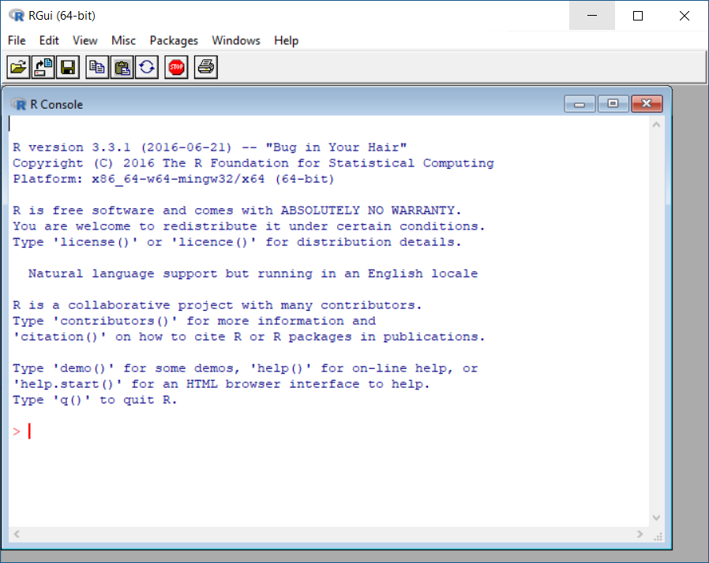

# Programowanie

## Narzędzia
### R

Aby zacząć naszą przygodę z programowaniem, będziesz potrzebował kilku narzędzi. Zacznijmy od środowiska programistycznego R. Wejdź na stronę [https://cran.r-project.org/](https://cran.r-project.org/) i znajdź linka do dystrybucji R odpowiadającej twojemu systemowi operacyjnemu. Link powinien być opisany jako *precompiled binary distributions of the base system and contributed packages* i występować w wersji dla systemu Windows, Linux albo MacOS. Ściągnij instalator i zainstaluj tak jak każdy inny program na twoim komputerze. Po udanej instalacji powinieneś zobaczyć gdzieś na swoim komputerze aplikację o nazwie `R x64 v.3.4.3` lub zbliżonej. Po uruchomieniu R wygląda jakoś tak:



Jeśli udało ci się uzyskać podobny obraz to świetnie - R zainstalował się i działa tak jak powinien. Możesz z czystym sumieniem go zamknąć i nie uruchamiać już nigdy więcej:)

### RStudio

Dlaczego nigdy więcej masz już nie uruchamiać R? Sam "goły" R wystarcza w 100 procentach do pracy, jednak my ułatwimy sobie życie poprzez skorzystanie ze zintegrowanego środowiska programistycznego (tzw. IDE). Takim środowiskiem, wymyślonym specjalnie do pracy w języku R jest program RStudio. RStudio posiada wiele funkcjonalności ułatwiających życie - kolorowanie składni, debugger, podgląd dokumentacji, projekty... O wszystkim dowiesz się w swoim czasie. Jak na razie wejdź na stronę [https://www.rstudio.com/](https://www.rstudio.com/) i ściągnij najnowszą wersję dla twojego systemu operacyjnego (RStudio jest programem typu *cross-platform*, czyli działa pod trzema najpopularniejszymi systemami operacyjnymi - Windowsem, MacOS i Linuxem). Po zainstalowaniu i uruchomieniu RStudio powinno wyglądać jakoś tak:

 

## Hello, world!

Jest taka tradycja wśród ludzi zajmujących się informatyką, że ucząc się zupełnych podstaw jakiegoś języka zaczynamy od programu, który napisze nam na ekranie słowa "Hello, world!". Zmuśmy więc R, żeby napisał nam coś takiego na ekranie. Otwórz R Studio i w konsoli (domyślnie w lewej dolnej części ekranu) napisz `"Hello, world!"`

```
> "Hello, world!"
[1] "Hello, world!"
```
